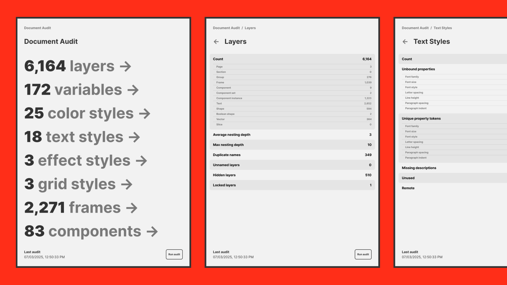

# Document Audit

Document Audit is a powerful Figma widget designed to provide a deep, structured analysis of your Figma document. It captures detailed statistics across layers, variables, styles, frames, and components — covering both local and remote assets — to help ensure consistency, proper tokenization, and metadata completeness.

## Key Features

**Comprehensive Layer Insights** \
Tracks all layers and their properties, including unbound tokens or raw values.

**Variables & Styles** \
Audits variables and style usage (color, text, effect, and grid), highlighting local vs. remote references.

**Component Analysis** \
Reports on component usage, instances, and metadata coverage.

**Frames & Layouts** \
Identifies layout patterns, spacing tokens, and potential inconsistencies.

**Metadata Completeness** \
Flags missing descriptions or documentation for better design handoff.

## AuditStats Schema Overview

The widget outputs an AuditStats object that includes the following categories:

- `layers`
- `variables`
- `colorStyles`
- `textStyles`
- `effectStyles`
- `gridStyles`
- `frames`
- `components`

Each category provides a local vs. remote breakdown, tokenization checks, binding state analysis, and completeness metrics.

Perfect for teams aiming to standardize design systems, improve naming hygiene, and maintain a high-quality, scalable design document.